# Hi 👋, I'm Ayşe Tuğba Peköz

### AI & Backend Developer | Computer Engineering

---

## 👩‍💻 About Me

I'm a **Computer Engineering student** focused on developing real-world applications using **Artificial Intelligence and Backend technologies**.

My main interests include **Machine Learning, Computer Vision, Natural Language Processing, LLMs, Semantic Search, Multimodal AI and AI Backend Development**.

* 🤖 Building AI-powered applications
* 👁️ Working on Computer Vision & Image Processing
* 🧠 Exploring LLMs, NLP and Semantic Search
* ⚙️ Developing AI services with FastAPI
* 🔬 Applying AI to real-world engineering problems
* 📚 Currently improving my Deep Learning & AI Engineering skills

---

## 🚀 Featured Project — Freeko-AI

### 🤖 AI-Powered Recruitment & Candidate Evaluation Platform

**Freeko-AI** is an AI-powered recruitment platform designed to support HR professionals throughout the candidate evaluation process.

It combines **CV analysis, semantic candidate matching, behavioral assessments, interview support and multimodal AI** within a FastAPI-based backend.

### 📄 Intelligent CV Analysis

* 🔍 Automatic CV parsing and information extraction
* 🧠 AI-assisted CV evaluation
* 📝 Automatic candidate summaries for HR professionals
* 🌍 Turkish & English CV processing
* 🎯 Skill, experience and job-requirement analysis
* 🔎 Detection of missing or insufficient candidate information

### 🎯 Semantic Candidate Matching

* SentenceTransformers-based embeddings
* FAISS vector similarity search
* Candidate ↔ Job semantic matching
* Candidate ranking
* Multilingual profile retrieval

### 🧠 Behavioral & Sabotage Assessment

Candidate evaluation extends beyond the CV through structured behavioral assessments.

* 🧩 Behavioral test analysis
* ⚠️ Sabotage / workplace-risk indicators
* 📊 Structured interpretation of candidate responses
* 🧠 Behavioral signals integrated into candidate evaluation

### 💬 AI-Assisted Interview Support

Freeko-AI can use information obtained during CV and behavioral analysis to identify **topics that should be explored more deeply during an interview**.

### 🔄 Recruitment AI Pipeline

`CV Analysis`

⬇️

`Semantic Candidate Matching`

⬇️

`Behavioral & Sabotage Assessment`

⬇️

`Risk / Candidate Insights`

⬇️

`Interview Deep-Dive Topics`

⬇️

`HR Decision Support`

### 🖼️ Multimodal Portfolio Analysis

* CLIP / OpenCLIP embeddings
* Portfolio image analysis
* Text ↔ Image similarity
* Visual relevance analysis
* Aesthetic characteristics
* Multimodal candidate scoring

### 🧬 Hybrid AI Architecture

`Rule-Based Analysis` + `Machine Learning` + `Semantic Search` + `LLM` + `Multimodal AI`

### ⚙️ Freeko-AI Technologies

**AI Stack:**
`SentenceTransformers` · `FAISS` · `CLIP/OpenCLIP` · `Gemini LLM` · `PyMuPDF`

---

## 🔬 Computer Vision — Flotation Froth Analysis

Computer vision project focused on analyzing **flotation froth images from mineral processing operations**.

The project investigates bubble morphology and froth characteristics to support process analysis and optimization.

### 🔍 Methods

* Canny Edge Detection
* Sobel & Scharr Operators
* Gaussian / Median / Bilateral Filtering
* Morphological Operations
* Image Enhancement
* Bubble Morphology Analysis
* Froth Edge Detection
* Peak / Region Analysis

### 🎯 Objective

Extract useful visual information such as:

`Bubble Count` · `Bubble Size` · `Bubble Distribution` · `Froth Density` · `Edge Characteristics`

to support further analysis of flotation processes.

---

## 🚗 Driver Drowsiness Detection

Real-time Computer Vision system designed to detect driver fatigue and potentially dangerous driving behavior.

* 👁️ Eye Aspect Ratio (EAR)
* 🥱 Mouth Aspect Ratio (MAR)
* 🧑 Head position analysis
* 🚨 Real-time warning system

**Stack:** `Python` · `OpenCV` · `Computer Vision`

---

## 🛠️ Tech Stack

### 💻 Programming

### 🤖 AI / Machine Learning

`Machine Learning` · `Computer Vision` · `NLP` · `LLMs` · `Semantic Search` · `Multimodal AI`

### ⚙️ Backend & Tools

### 🗄️ Data

`NumPy` · `Pandas` · `FAISS`

---

## 📊 GitHub Analytics

## 📊 GitHub Analytics

---

## 🔥 GitHub Streak

---

## 🐍 Contribution Snake

<picture>
  <source media="(prefers-color-scheme: dark)" srcset="https://raw.githubusercontent.com/aysetugbapekoz/aysetugbapekoz/gh-pages/github-contribution-grid-snake-dark.svg">
  <source media="(prefers-color-scheme: light)" srcset="https://raw.githubusercontent.com/aysetugbapekoz/aysetugbapekoz/gh-pages/github-contribution-grid-snake.svg">
  
</picture>

---

## 🌱 Currently Exploring

🧠 Deep Learning
🤖 Large Language Models
👁️ Advanced Computer Vision
🔎 Retrieval-Augmented Generation (RAG)
⚡ AI Backend Architecture
☁️ AI Model Deployment

---

## 🌐 Connect With Me

---

### 💡 Building intelligent systems where AI meets real-world engineering.

⭐ **AI • Machine Learning • Computer Vision • NLP • Backend**

